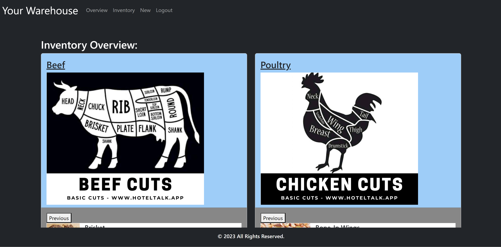

# Inventory Management System

 
Licensing: [mit](https://choosealicense.com/licenses/mit/)
    
## Table of Contents
  
- [Description](#description)
- [Installation](#installation-requirements)
- [Usage](#application-usage)
- [License](#licensing-information)
- [Contributions](#contributions)
- [Tests](#tests-commands)
- [Video Link](#link-to-video-instructions)
- [Screenshot](#screenshot)
- [Questions](#questions)
  
## Description
A clean, commercial inventory management system utilizing our owdatabase and a custom UI that provided user-friendly interaction.
  
## Installation Requirements
bcryptjs@2.4.3 

connect-session-sequelize@7.0.4 

dotenv@8.6.express@4.17.1 

express-handlebars@5.2.0 

express-session@1.17.1

handlebars@4.7.6 

mysql2@2.3.3 

sequelize@6.29.3 

slick-carousel@1.8.1
  
## Application Usage
Track and provide immediate, up-to-date, inventory item managemenutilizing a clean and responsive UI. Available on any device.
    
## Contributions
Chris Gaye 

Nate Park 

Eric Keeton
  
## Test Commands
npm run seed 

npm run start
  
## Screenshot

  
## Questions
For Questions, contact me at emk2473@gmail.com or visit My Github[emk2473](https://github.com/emk2473)
  
  